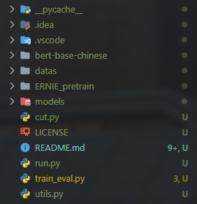

# Bert-Chinese-Text-Classification-Pytorch
[](https://github.com/996icu/996.ICU/blob/master/LICENSE)

中文文本多标签分类，Bert，ERNIE，基于pytorch，开箱即用。

## 介绍
模型介绍、数据流动过程：<https://comdy.blog.csdn.net/article/details/125949887#t1>

机器：一块3060

## 环境
python 3.11  
pytorch 2.0。1  
tqdm  
sklearn  
tensorboardX  


### 更换自己的数据集
 - 按照我数据集的格式来格式化你的中文数据集。  


## 效果

模型|acc|备注
--|--|--
bert|94.83%|单纯的bert
ERNIE|94.61%|说好的中文碾压bert呢  
bert_CNN|94.44%|bert + CNN  
bert_RNN|94.57%|bert + RNN  
bert_RCNN|94.51%|bert + RCNN  
bert_DPCNN|94.47%|bert + DPCNN  

原始的bert效果就很好了，把bert当作embedding层送入其它模型，效果反而降了，之后会尝试长文本的效果对比。

CNN、RNN、DPCNN、RCNN、RNN+Attention、FastText等模型效果，请见我另外一个[仓库](https://github.com/649453932/Chinese-Text-Classification-Pytorch)。  

## 预训练语言模型
bert模型放在 bert-base-chinese目录下，ERNIE模型放在ERNIE_pretrain目录下，每个目录下都是三个文件：
 - pytorch_model.bin  
 - bert_config.json  
 - vocab.txt  

预训练模型下载地址：  
bert_Chinese: 模型 https://s3.amazonaws.com/models.huggingface.co/bert/bert-base-chinese.tar.gz  
              词表 https://s3.amazonaws.com/models.huggingface.co/bert/bert-base-chinese-vocab.txt  
来自[这里](https://github.com/huggingface/pytorch-transformers)   


ERNIE_Chinese: http://image.nghuyong.top/ERNIE.zip  
来自[这里](https://github.com/nghuyong/ERNIE-Pytorch)  

解压后，按照上面说的放在对应目录下，文件名称确认无误即可。  

## 使用说明


1. bert-base-chinese：bert的预训练文件；
2. model：存放bert模型代码；
3. datas：data存放数据集；log 保存 run 时运行日志
4. run.py：项目运行主程序；
5. utils.py：处理数据集并且预加载；
6. train_eval.py：模型训练、验证、测试代码
7. cut.py：划分测试集、验证集、训练集脚本

[1] 数据集文件的构成

](image/md/image.png)

其中，class1.csv是原数据集文件，训练集train.csv、验证集dev.csv、测试集test.csv是之前拆分好的，class.txt是标签目录，label.pkl是压缩存储的标签，方便快速读取用的。

[2] 加载数据集
加载数据集的目标是：1）把文本数据转化成BERT模型的词序、Mask 码，为输入进BERT作准备；2）把文本标签转化成独热数组。

```text
详细代码见utils.py -----> def build_dataset(config)
```

首先，加载label.pkl文件。对于每一条文本，先提取它的标签，然后转化成独热数组。接下来通过tokenizer.encode_plus编码文本，得到input_ids与attention_mask。最后把这些数据都存到数组contents中。

[3] 数据集加载器

```text
详细代码见utils.py -----> class DatasetIterater(object)
```
这个完全是自定义的数据加载器，直接用就可以。

`到这里，数据加载的部分就结束了。需要在数字化数据外套一个数据加载器的原因是，回头在调epoch、batch_size这些参数的时候，数据加载器能够自动帮我们分配好这些文本数据。`

[4] BERT模型代码
BERT模型代码分为两个文件，一个是ERNIE.py保存通用配置，一个是bert.py保存实际代码。

[5] 实战

```text
详细代码见train_eval.py
```
](image/md/image3.png)
1. train：训练
    需要解释的几点：
    (1). bert模型采用AdamW做优化，不同层要设置不同的权重衰减值；
    (2). writer这个变量主要是做数据可视化的，参考博客：[深度学习】pytorch使用tensorboard可视化实验数据。](https://blog.csdn.net/qq_43592352/article/details/125859737)
2. APH：损失函数与评价指标
    多标签文本分类任务，用的损失函数是BCEWithLogitsLoss，不是交叉熵损失函数cross_entropy！！
    ```text
    BCEWithLogitsLoss与cross_entropy有什么区别？
    1）cross_entropy它就是算单标签的损失的，大家去看一下它的公式，它对一个文本只取概率最大的那个标签；
    2）BCEWithLogitsLoss对模型输出取的是sigmoid，而cross_entropy对模型的输出取的是softmax。sigmoid和softmax虽然都是把一组数据放缩到[0,1]区间，但是softmax具有排斥性，放缩后的一组数据之和为1，所以这样一组标签概率只会有一个较大值；而sigmoid也是把一组数据放缩到[0,1]区间，但它更类似于等比例缩放，原来大的数现在还大，可以有多个较大的概率存在，所以sigmoid更适合在多标签文本分类任务中。所以要使用BCEWithLogitsLoss。
    ```
     此项目中使用的评价指标有：准确率accuracy、精确率precision、汉明损失hamming_loss。是基于sklearn库实现的。
    ```text
    还有其他评价指标，召回率、F1等等，评价指标还分可为micro和macro，种类较多，可以参考地址：https://scikit-learn.org/stable/modules/classes.html#module-sklearn.metrics。
    ```

3. Predict：采样
    采样是指：把模型输出出来的概率，转化成独热数组，通常使用阈值为0.5的阈值函数，即概率大于0.5的标签采样为1，否则为0。

4. test & evaluate：评估与测试

[6] 运行
run.py

### 参数
模型都在models目录下，超参定义和模型定义在同一文件中。  


## 对应论文
[1] BERT: Pre-training of Deep Bidirectional Transformers for Language Understanding  
[2] ERNIE: Enhanced Representation through Knowledge Integration  
