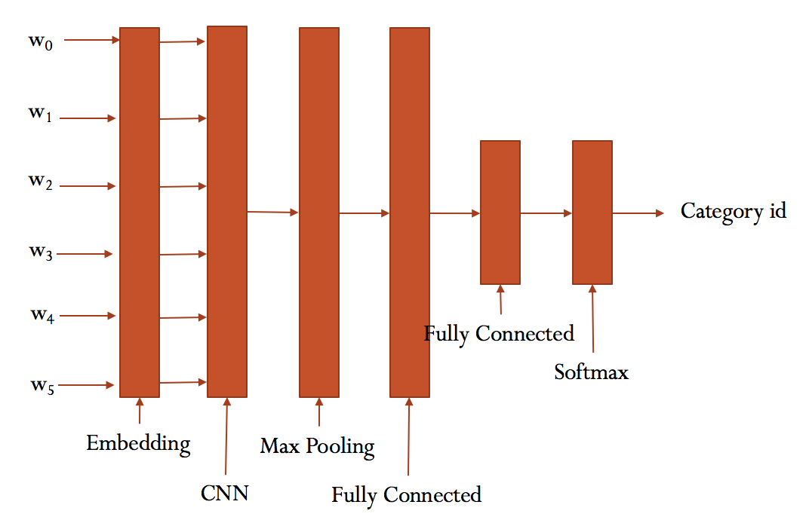

# Mutli Label Text Classification

使用卷积神经网络、循环神经网络、fasttext进行中文文本分类。源码修改自[text-classification-cnn-rnn](https://github.com/gaussic/text-classification-cnn-rnn)，增加多标签预测功能，添加Fasttext模型的训练和预测模型。

本文是基于TensorFlow在cail数据集进行的训练和测试，使用了字符级CNN和RNN对中文文本进行分类，达到了较好的效果。

## 环境

- jieba
- TensorFlow
- numpy
- scikit-learn
- scipy

详细版本见 requirements.txt

## 数据集

### 数据概览

数据来源于cail法律数据集，数据集中包括犯罪的陈述，罪名，罚金以及刑期信息，模型主要对每一个条目的罪名进行预测，每一个犯罪事实可能会涉及到多个罪名，属于多标签预测问题。
每个条目的信息如下：
```json
{
    "meta": {
        "criminals": ["段某"],
        "term_of_imprisonment":{
            "death_penalty": false,
            "imprisonment": 12,
            "life_imprisonment": false
        },
        "punish_of_money": 0,
        "accusation": ["故意伤害"],
        "relevant_articles": [234]
    },
    "fact": "昌宁县人民检察院指控，2014年4月19日下午16时许，被告人段某驾拖车经过鸡飞乡澡塘街子，时逢堵车，段某将车停在“冰凉一夏”冷饮店门口，被害人王某的侄子王2某示意段某靠边未果，后上前敲打车门让段某离开，段某遂驾车离开，但对此心生怨愤。同年4月21日22时许，被告人段某酒后与其妻子王1某一起准备回家，走到鸡飞乡澡塘街富达通讯手机店门口时停下，段某进入手机店内对被害人王某进行吼骂，紧接着从手机店出来拿得一个石头又冲进手机店内朝王某头部打去，致王某右额部粉碎性骨折、右眼眶骨骨折。经鉴定，被害人王某此次损伤程度为轻伤一级。"
}
```

### 数据预处理

数据预处理分为三个部分：
1、提取json文件中需要识别的文本和标签
2、将提取出的内容进行分词。
3、将内容和标签组合成需要的数据格式。
如果需要只对标签进行调整，可以只运行1和3，不需要重新进行分词。

### 数据格式
模型也可以使用自己的数据进行训练和预测，数据集需要被整体为Fasttext进行多标签预测需要的格式，格式如下：
W1 W2 W3 __label__l1 __label__l2
其中W1 W2...为使用jieba分词后的句子，词以空格分割，__label__l为句子的标签，可以有多个标签，以空格分割。
本次训练使用了其中的202个分类，一共约20W条数据。

数据集大小详细如下：

- 训练集: 154592
- 验证集: 17131
- 测试集: 32508

## 预处理

`data_loader.py`为数据的预处理文件。

- `read_file()`: 读取文件数据;
- `build_vocab()`: 构建词汇表，使用字符级的表示，这一函数会将词汇表存储下来，避免每一次重复处理;
- `read_vocab()`: 读取上一步存储的词汇表，转换为`{词：id}`表示;
- `read_category()`: 将分类目录固定，转换为`{类别: id}`表示;
- `to_words()`: 将一条由id表示的数据重新转换为文字;
- `process_file()`: 将数据集从文字转换为固定长度的id序列表示;
- `batch_iter()`: 为神经网络的训练准备经过shuffle的批次的数据。


## CNN卷积神经网络

### 配置项

CNN可配置的参数如下所示，在`cnn_model.py`中。

```python
class TCNNConfig(object):
    """CNN配置参数"""

    embedding_dim = 64      # 词向量维度
    seq_length = 600        # 序列长度
    num_classes = 10        # 类别数
    num_filters = 128        # 卷积核数目
    kernel_size = 5         # 卷积核尺寸
    vocab_size = 5000       # 词汇表达小

    hidden_dim = 128        # 全连接层神经元

    dropout_keep_prob = 0.5 # dropout保留比例
    learning_rate = 1e-3    # 学习率

    batch_size = 64         # 每批训练大小
    num_epochs = 10         # 总迭代轮次

    print_per_batch = 100    # 每多少轮输出一次结果
    save_per_batch = 10      # 每多少轮存入tensorboard
```

### CNN模型

具体参看`cnn_model.py`的实现。

大致结构如下：



## RNN循环神经网络

### 配置项

RNN可配置的参数如下所示，在`rnn_model.py`中。

```python
class TRNNConfig(object):
    """RNN配置参数"""

    # 模型参数
    embedding_dim = 64      # 词向量维度
    seq_length = 600        # 序列长度
    num_classes = 10        # 类别数
    vocab_size = 5000       # 词汇表达小

    num_layers= 2           # 隐藏层层数
    hidden_dim = 128        # 隐藏层神经元
    rnn = 'gru'             # lstm 或 gru

    dropout_keep_prob = 0.8 # dropout保留比例
    learning_rate = 1e-3    # 学习率

    batch_size = 128         # 每批训练大小
    num_epochs = 10          # 总迭代轮次

    print_per_batch = 100    # 每多少轮输出一次结果
    save_per_batch = 10      # 每多少轮存入tensorboard
```

### RNN模型

具体参看`rnn_model.py`的实现。

大致结构如下：


## References：

[Convolutional Neural Networks for Sentence Classification](https://arxiv.org/abs/1408.5882)

[Character-level Convolutional Networks for Text Classification](https://arxiv.org/abs/1509.01626)